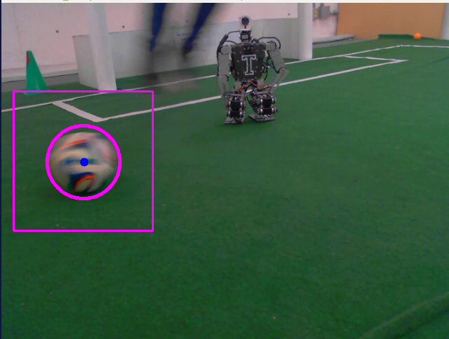
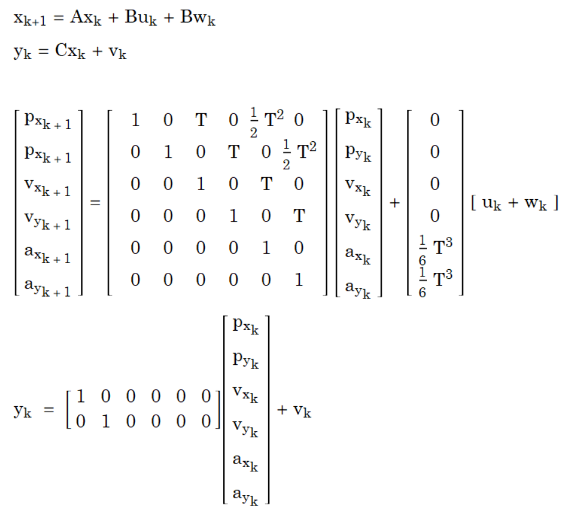
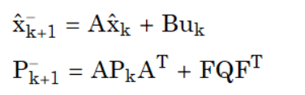
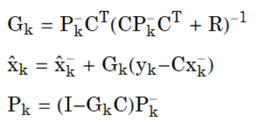
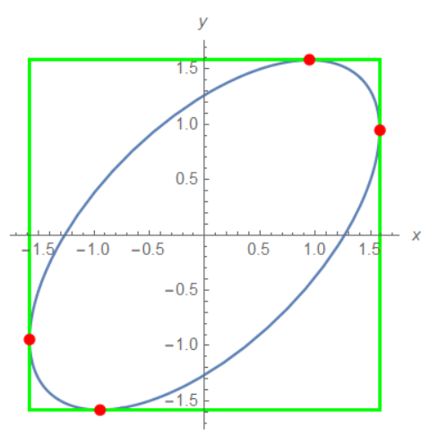

# Vision detect and track
## 1. Description

<p align="justify">
The main  objective of this repository is to provide a set of computer vision tools to detect and track objects and to educate beginners about the emerging technologies that are used in robotic applications.  These systems where developed using the Robotic Operating System and the Open Source Computer Vision library for C++11. It is important to remark that this package was particularly designed to identify a soccer ball inside a soccer field. The tools implemented in the repository are:
</p>

* Kalman Filter + HAAR/LBP Cascade
* Particle Filter + Color Detection
* Kalman Filter + Color Detection
* SURF
* Camera Angular Position Control (Dynamixel Servomotors)


## 2. Requirements
### Software

1. [ROS1 Kinetic Kame](http://wiki.ros.org/kinetic/Installation)
2. [OpenCV3 for ROS](https://github.com/aaceves/opencv_tutorial)
3. [Dynamixel libraries for ROS](https://github.com/aaceves/example_dynamixel)

    And if you want to train your own detection cascade:

4. [Computer Vision toolbox for MATLAB](https://www.mathworks.com/products/computer-vision.html)

### Hardware

1. Webcam

    In order to use Dynamixel motors, the following components are needed:

2. Dynamixel motors
3. Switched Modulated Power Supplier
4. U2D2-power-hub / USB2Dynamixel + SMPS2Dynamixel

For more details check this readme: https://github.com/aaceves/example_dynamixel

## 3. Installation
### Installation Guide

Once the requirements have been met and the [catkin workspace](http://wiki.ros.org/ROS/Tutorials/InstallingandConfiguringROSEnvironment) have been set up, the next step is to clone and build this repository typing the following commands in a new terminal:
```bash
cd catkin_ws/src
git clone https://github.com/marcovc41/vision-detect-and-track.git
cd ..
catkin_make
source devel/setup.bash
```
Depending on how you set your workspace, `catkin build` may be used instead of `catkin_make`.

If all the steps where successfully completed,  no errors should appear after building the code. Note: A dynamixel library error would appear if you haven't installed dynamixel library yet. If you are not interested in using dynamixel motors, please errase the corresponding lines that refer to the track program in the package CMakeLists (`vision_tools/CMakeLists.txt`) and also the text "dynamixel_sdk" that appears inside "find_package" function, then build your workspace again and the problem should be fixed.

Before running the nodes, some modifications to the code are needed due to the changes in directories for your machine.

For the SURF node: In the downloaded repository, open `/vision_tools/src/SURF.cpp` with your favorite text editor. Look for the `path_image` variable assignment inside the main function, change it according to your corresponding path, in my case it is `path_image= "/home/marco/catkin_ws/src/vision_tools/img/cuad2.png";`. The path that you have to write is the path of the sample image that you will search using the SURF algorithm.

For the detect node: open `/vision_tools/src/DetectBall.cpp` and change the ball.cascade path inside the main function, II section. In my case it looks like `if( !ball_cascade.load("/home/marco/catkin_ws/src/vision_tools/cascade/ballDetector.xml" ))`, you have to provide the complete path of the cascade detector trained file that is located in the cloned repository `/vision_tools/cascade/ballDetector.xml`. After these steps, build the packages again and you will be able to use the programs.

### Using the programs

In order to verify that the installation was successful, run the following command:
```
roscore
cntrl+shift+T
rosrun vision_tools particlefilter
```
Then rosmaster will arise and a screen with your webcam image and the particle filter must appear. If these happens, congratulations, you are now ready to prove each of the algorithms included in this package.
The way to run each of the ROS nodes is described below:

###### Kalman Filter + HAAR/LBP Cascade
```
rosrun vision_tools detect <debugger mode (0/1)> [path to video]
```
###### Kalman Filter + Color Detection
```
rosrun vision_tools kalmanfilter <debugger mode (0/1)> [path to video]
```
###### Particle Filter + Color Detection
```
rosrun vision_tools particlefilter
```
###### SURF
```
rosrun vision_tools SURF
```
###### Dynamixel motors
```
rosrun vision_tools track
```

## 4. Code explanation

For a deeper understanding, usage details and algorithm explanation, check the following files:

* [Kalman Filter](code_explanation/kalmanfilter.md)
* [Particle Filter](code_explanation/particlefilter.md)

## 5. Theory
### ROS


The [Robot Operating System (ROS)](https://www.ros.org/) is a flexible modular framework for writing robot software. It is a set of open source software libraries and tools that aim to simplify developing robot applications. This ecosystem provides services such as hardware abstraction, low-level device control, package management, communications infrastructure, diagnostics, pose estimation, localization, mapping, navigation, GUI, simulation, computer vision, etc. If you want to know more about using ROS, please check [ROS1 wiki](http://wiki.ros.org/ROS), I highly recommend completing the tutorials.

Due to the amount of packages available, Kinetic Kame [ROS distribution](http://wiki.ros.org/Distributions) is used for this package. However, it is getting older and it will reach its end of life starting 2021, therefore a migration from Kinetic Kame to Melodic Morenia must be sought soon.

### OpenCV


The [Open Source Computer Vision Library](https://opencv.org/) is a set of software functions that provide a common infrastructure for computer vision and machine learning applications with over 2500 optimized algorithms. These algorithms can be used to detect faces, identify objects, track moving objects, image processing, etc. OpenCV3 is the default version for ROS Kinetic and it is linked to ROS in such a way that it is already a system dependency. In order to install this library, check this [repository](https://github.com/aaceves/opencv_tutorial) and [ROS documentation](https://wiki.ros.org/vision_opencv). I attached some links if you want to know more about the different [functions](https://docs.opencv.org/2.4/modules/refman.html) available and application [examples and tutorials](https://docs.opencv.org/3.3.1/d9/df8/tutorial_root.html). More tutorials (in spanish) can be found [here](http://acodigo.blogspot.com/p/tutorial-opencv.html).

In order to improve the programs performance, [Open Computer Language (OpenCL)](https://opencv.org/opencl/) acceleration for OpenCV was used, providing some OpenCV algorithms access to the GPU, therefore GPU instead of CPU instructions will be executed automatically if a compatible device is available and makes sense from the performance point of view. OpenCL is compatible with AMD and Intel GPUs.

### Kalman Filter


In simple terms, the Kalman Filter is an observer that estimates the state of a system in the presence of noisy measurements [1]. In more precise terms it is a recursive filter, manifested as a set of mathematical equations that implement a predictor-corrector type estimator that is optimal in the sense that it minimizes the estimated error covariance. This algorithm is commonly used for tracking tasks, motion prediction and multi-sensor fusion. [2] If you are not acquainted with this filter, you can check this [Matlab video series](https://www.mathworks.com/videos/series/understanding-kalman-filters.html) and read [Welch and Bishop introduction](http://www.cs.unc.edu/~tracker/media/pdf/SIGGRAPH2001_CoursePack_08.pdf#G6.39557.000). Also Matlab documentation includes a demonstration of the Kalman Filter for [object tracking with vision](https://www.mathworks.com/help/vision/examples/using-kalman-filter-for-object-tracking.html).

Because of these properties, the Kalman Filter algorithm was implemented in code in order to track the ball and estimate its position, velocity and acceleration. In this package, it was combined with two different detection methods: Color Detector and a Cascade Object Detector. The latest version of the program is the detect node (KF with cascade object detector), which implements some corrections on minor bugs and optimizes the code to increase the performance.
In order to detect and track the soccer ball, a Discrete-Time Linear Gaussian State Space Model of a particle with uniform acceleration was used, since it would detect the change of acceleration due to friction losses and have a better prediction:

<p align="center">

</p>

Having this model defined, the KF equations were implemented:

##### Prediction step

<p align="center">

</p>

##### Measurement update

<p align="center">

</p>

Where the prediction step uses the defined system model and the measurement update uses the corresponding ball detector algorithm, that means the centroid of either the biggest color blob or the positive cascade detection depending on the position measurement "sensor" implemented with the filter.

The parameters that can be changed to adjust the filter behavior are the measurement and system noise covariances, so that if the measurement covariance increases, we are trusting less in the measurement and more in the system model, and the reciprocal happens when changing the system covariance. Another important value is the sampling time, which in many applications is set as 1, since it only affects the system model, however it can be changed to set how the velocity and acceleration is calculated and thus how sensitive the Kalman Filter will be. This is important for the prediction step and must be adjusted at the same time as the covariances, since the covariance matrix P depends on the system input matrix B and therefore depends on the sampling time.

* v = 30
* w = 3000
* t = 0.04



Is good to remark that the covariances magnitudes affect directly the error covariance matrix P magnitude, which is used in our algorithm to delimit the region of interest where the object is sought. This is because the KF is designed to reduce this error covariance matrix with each iteration, however, when the object disappears, the error propagates since the uncertainty of the object position increases with time. Then, the submatrix of P that corresponds to the covariances of the position will give us a region where the object actually is. This submatrix has a geometric interpretation of a rotated ellipse which represents a confidence interval with certain precision, for example, if we desire a certainty of 99%, that means embracing 99 percent of the volume below the gaussian probability density function, the error ellipse will encompass a bigger area than having a certainty of 95%. The angle of rotation depends on the correlation of the x and y position, but for this case the covariances are null and only individual variances exist, leading to an horizontal (or vertical) ellipse, and since this variances are exactly equal for each dimension, the ellipse results in a circle. In order to perform a submatrix extraction of the ROI for each captured frame, this ellipse was mapped into an auxiliary rectangle so that the error ellipse is inscribed inside it. The figure in the right shows in green an example of an error ellipse (blue) and the auxiliary rectangle (green). The code to perform this mapping operation can be founded commented inside the getErrorEllipse function in the KalmanFilter.cpp code, for this particular situation, just obtaining the error circle radius r and obtaining a 2r side square is enough and saves a lot of computational time.

### Particle Filter

The Particle Filter or Sequential Monte Carlo Method provides an approximate solution to the nonlinear filtering problem, in contrast with the Kalman Filter which works only with linear gaussian distributed noise. The main idea of this concept is the usage of N samples or particles spread out in the state-space, each of them representing one hypothesis of the state x<sub>k</sub> of the system. Then a weight w is assigned to each particle depending on how probable that state is. Thus, the most likely samples are kept, resampled according to the weight and then propagated further to x<sub>k+1</sub> using the system model. If you are not aware of the particle filter you can check [Andreas Svensson videos](https://youtu.be/aUkBa1zMKv4) and read his [introduction](https://www.it.uu.se/katalog/andsv164/Teaching/Material/PF_Intro_2014_AndreasSvensson.pdf) and for more advance understanding read [Schön and Lindsten introduction](http://www.it.uu.se/research/systems_and_control/education/2017/smc/SMC2017.pdf)

The steps of the particle filter used for the programs are defined below:

##### Weight function

Since the weight corresponds to the probability of the state being correct, we obtain the Euclidian Norm from the measurement (in this case is a well defined combination of the HSV value for the color sought) to the evaluation of the color in one particle. Then using a gaussian probability density function as the weighting function, and evaluating it with this euclidian norm, the weight value w for each particle is found. Finally this is repeated for the N particles and then all the weights are normalized to 1.

##### Resampling

The resampling step is about generating new set of equally weight samples, considering the already weighted set. To do this, imagine a pie chart of area 1, with N slices representing the particles and each slice has a width that corresponds to the area w of the weight of each particle, summing 1 as said before. Then, N dots are placed with a uniform distribution random way along all the chart. As consequence, the slices that are bigger will contain more dots than the ones that are narrower. This is exactly what is implemented in the code. The particles with bigger weights are replicated many times but with a uniform probability, while the less likely ones have less or even none particles. Always keeping an N number of particles.

##### Propagate

In order to propagate the particles, a constant velocity system model with uniform distributed random noise was proposed, because the N particles have to be spread using this model, so in order to reduce the computational resources used, a simple model was chosen.

### Cascade Object Detector

The cascade object detector is a trained classifier that looks for specific characteristics in an image. This characteristics are set by training the cascade with a set of images of the object that will be seek.
There are many different characteristics that define an object, some of the most used for classifiers are:
* Haar features
* Local Binary Patterns (LBP)
* Histograms of Oriented Gradients (HOG)

For mores information about some of these features, check this [opencv tutorial](https://docs.opencv.org/3.4/db/d28/tutorial_cascade_classifier.html).

#### Training

For the reason of avoiding complexity, the classifier training was done using Matlab and the Computer Vision Toolbox.
The steps for training your own cascade are described below, however if you want to know more details, check Matlab wiki about [training classifiers](https://www.mathworks.com/help/vision/ug/train-a-cascade-object-detector.html) and [labeling images](https://www.mathworks.com/help/vision/ug/get-started-with-the-image-labeler.html).


(https://www.mathworks.com/videos/series/understanding-kalman-filters.html)
https://www.mathworks.com/help/vision/examples/using-kalman-filter-for-object-tracking.html
https://www.ros.org/
http://wiki.ros.org/ROS

https://www.visiondummy.com/2014/04/draw-error-ellipse-representing-covariance-matrix/
